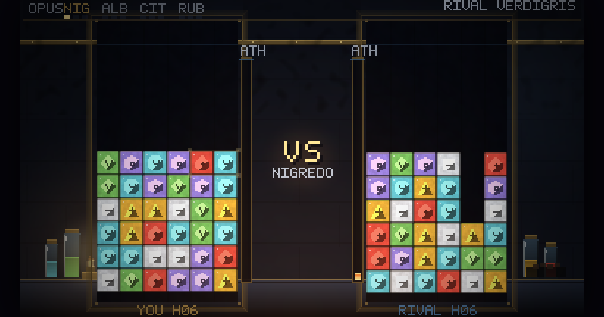

# ALKAHEST

A match-panel machine on an alchemist's bench. Climb the four acts of the Magnum Opus
against rival signatures — the register is the physics: each act changes how the machine
behaves, not just how it looks.

**Play it:** https://lerugray.github.io/field-trials/alkahest/



## Run it

`index.html` loads the sources directly, so it opens from `file://` with no server:

```bash
open index.html
```

Or build the single self-contained file:

```bash
npm run build          # writes dist/alkahest.html
```

## Test it

```bash
npm test               # node --test — 215 tests (213 pass, 2 skipped)
node scripts/proof.js  # renders deterministic proof frames for each act to runs/proof/
```

`scripts/proof.js` encodes the *same* framebuffer the browser blits, in Node, with no
browser in the loop — so every art change can ship a committed, dated frame to look at.

## What's in here

- `src/` — the machine, the well, acts, formulae, duel logic, software renderer.
- `test/` — the suite, including softlock, determinism and perf gates.
- `scripts/build.js` — zero-dependency single-file bundler. `scripts/proof.js` — the
  deterministic frame renderer.
- `DESIGN-SEED.md` — the founding contract, including the clean-room law governing the
  mechanical reference.
- `AUDIT-SKEPTICAL-2026-08-11.md` — the adversarial pre-release audit. Verdict:
  **FIX-FIRST**, six findings. Findings 1–4 (a tutorial-completion crash and three
  lesson-stall defects) were fixed before release; finding 5 (no player-facing
  photosensitivity control) was left open and **disclosed on the release card** rather
  than quietly shipped.
- `docs/STUDY-*.md` — the mechanical studies the build was written against: the machine,
  the duel, the run structure, art and music.

## Credits and asset licensing

All art and audio is generated by the game's own code. No third-party assets.

## A note on references to files that are not here

The design and audit documents in this directory sometimes cite the build-session harness
— the builder's hard-rules file, the running progress log, the dated operator direction
documents, the per-lane reports. Those are working documents of the build method and are
not published in this portfolio repository, so those citations point outside it. The
documents are otherwise verbatim: they are evidence, and editing them to tidy up the
references would make them worth less.
