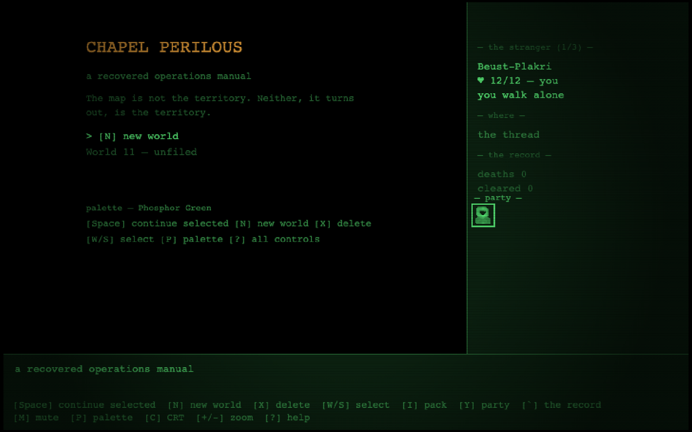

# CHAPEL PERILOUS

A first-person grid dungeon crawler wrapped in an Ultima-style overworld — the classic
form played straight — inhabited by the register of the Illuminatus! trilogy instead of
Lovecraft. Paranoia, conspiracy, Discordian signal-noise; the dungeon is the place where
you can no longer tell whether the pattern is real.

**Play it:** https://lerugray.github.io/chp-preview/



## Run it

The modular ES graph under `src/` is the development entry, and browsers block ES module
imports over `file://`, so serve the directory over http:

```bash
python3 -m http.server 8765     # any static server works
# open http://localhost:8765/
```

For a double-clickable build, regenerate the self-contained artifact:

```bash
npm run build          # writes chapel-perilous.html at the repo root
```

One file: CSS, JS and all `data/*.json` inlined, zero `import`/`export`.

## Test it

```bash
npm test               # node --test — 605 tests
```

Browser probes (require Playwright):

```bash
npm install --no-save playwright && npx playwright install chromium
node scripts/probe-audio.mjs
node scripts/soak-chp.mjs        # long-run soak against the built artifact
```

## Keys

| Key | Action |
|-----|--------|
| Space | Continue selected (title); accept the dealt stranger (creation) |
| E | Embark (creation); enter site/door (overworld/city) |
| Esc | Creation → title; surface from dungeon/city |
| R | Deal another stranger (creation); rest (overworld) |
| H | The manual — the operations questline reader |
| P / C | Cycle palette / toggle CRT |
| + / - | Step display scale |
| L / K / O | Open the record / save / load |

Every New Game mints a fresh seed; terrain and sites generate deterministically from it,
so a world is reproducible from its seed alone.

## What's in here

- `src/`, `data/` — engine and the JSON content the engine extends by.
- `test/`, `test-support/` — the suite and its harness.
- `scripts/` — the single-file build, audio probe, soak, and capture tooling.
- `DESIGN-SEED.md` — the founding contract, including the clean-room law: the reference's
  *format* is characterised and rebuilt; nothing is extracted from it, ever.
- `docs/audits/M12-STUDIO-AUDIT-2026-08-03.md` — a five-role adversarial studio audit
  (QA, UX, game design, systems, art direction) against a real playtest.
- `docs/audits/M12-CONTRACT-CRITIQUE-2026-08-03.md` — a critique that **refuted the build
  contract itself** as not executable enough for an autonomous builder, and listed the
  blockers, before any of it was built.
- `docs/GENRE-AUDIT-2026-08-02.md`, `docs/LOOP-CRITIQUE-2026-08-10.md` — genre
  table-stakes, then a three-panelist critique of whether the loop has teeth or "plays as
  an art project".
- `docs/CHARACTER-DESIGN-*.md`, `docs/CONTENT-IDENTITY-*.md`, `docs/CYCLOPEAN-ART-STUDY-*.md`
  — the design and reference studies the build answers to.

## Credits and asset licensing

Every committed asset is generated by the game's own code — canvas-drawn tiles, sprites
and UI, code-defined palettes, and a procedural WebAudio score seeded off the world seed.
There are no audio or image binaries in this repository; `assets/og/og.png` is the
generated share card. No third-party assets.

## A note on references to files that are not here

The design and audit documents in this directory sometimes cite the build-session harness
— the builder's hard-rules file, the running progress log, the dated operator direction
documents, the per-lane reports. Those are working documents of the build method and are
not published in this portfolio repository, so those citations point outside it. The
documents are otherwise verbatim: they are evidence, and editing them to tidy up the
references would make them worth less.
