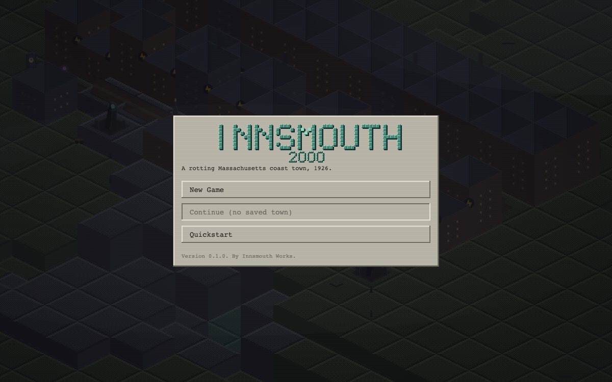

# INNSMOUTH 2000

A Lovecraftian clean-room transposition of the classic 1993 Maxis city-builder format:
zone a rotting Massachusetts coastal town, trade a tax base of the Unwary against a favor
economy of Cultists and Deep Ones, and appease five gods whose wrath is the disasters
menu. It looks like a lost 1994 disk and runs from a double-clicked file.

**Play it:** https://i2-preview.pages.dev/



## Run it

Open `index.html` for the source build, or build the single self-contained artifact:

```bash
npm run build          # writes dist/innsmouth2000.html
open dist/innsmouth2000.html
```

Zero runtime dependencies. If `assets/music/` is not sitting beside the file, the game
runs silent by design and says so in the Help window rather than erroring.

## Test it

```bash
npm test               # node --test — 417 tests (416 pass, 1 skipped)
```

The skipped test is the Playwright pixel gate; it unskips automatically when Playwright
and a built artifact are both present:

```bash
npm install --no-save playwright && npx playwright install chromium
npm run build && npm test
```

There is also a pure test that guards the build's hand-maintained module list — a module
left off it is silently dropped from the bundle while the suite stays green. That cost a
real blank build to learn, so it is a test now.

## Playing

Press **Q** for the in-game quickstart (placement, your first road, power, the dread
meter); `[?]` opens the full controls list. The game boots to a title screen with a
scenario/difficulty picker, a single save slot, and an autosave every six sim months; a
corrupt or missing save falls back to the title screen rather than crashing.

## What's in here

- `src/`, `test/` — the simulation, the dimetric renderer, the OS-style window chrome,
  and the suite.
- `scripts/` — the single-file build, capture and playtest drivers.
- `DESIGN-SEED.md` — the founding contract, the aesthetic law ("could this pass as a 1994
  screenshot? does it look cheap?"), and the clean-room rule for the reference.
- `docs/CERT-I2-WATER-2026-08-09.md` — an adversarial certification dossier: ~18 minutes
  of live headless play across four sessions, canvas driven by real mouse and keyboard.
  Verdict: **defects found — 1 blocker, 3 defects, 3 friction items**, each with a repro.
- `docs/GENRE-CHECKLIST.md`, `docs/STUDY.md` — genre table-stakes and the reference study.
- `docs/PLAYTEST-*.md`, `docs/RATIFY-M8-DECISIONS.md` — playtest observations and the
  decisions taken from them.

## Credits and asset licensing

All art is code-generated; the reference is characterised in the study, never copied. The
one exemption is the music in `assets/music/` — operator-supplied tracks credited to the
pseudonym **Abel Aeolian**. Per-track notes and the terms they ship under are in
`assets/music/README.md`.

## A note on references to files that are not here

The design and audit documents in this directory sometimes cite the build-session harness
— the builder's hard-rules file, the running progress log, the dated operator direction
documents, the per-lane reports. Those are working documents of the build method and are
not published in this portfolio repository, so those citations point outside it. The
documents are otherwise verbatim: they are evidence, and editing them to tidy up the
references would make them worth less.
