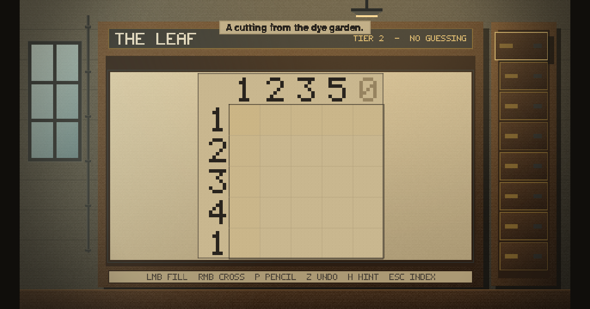

# THE JACQUARD INDEX

The pattern library of Reedmoor Mill, est. 1889. Nonograms that never ask you to guess —
every card is proved solvable by deduction alone before it ships, and each drawer of the
index adds exactly one twist to the base rules.

**Play it:** https://lerugray.github.io/field-trials/jacquard-index/



## Run it

The game is ES modules under `src/`, bundled into one self-contained HTML file:

```bash
node build.js          # writes dist/jacquard-index.html
open dist/jacquard-index.html
```

The built file has no network needs and no runtime dependencies — it boots from a
double-click or from `file://`.

## Test it

```bash
npm test               # node --test — 252 tests
node scripts/dist-smoke.js   # runs the built bundle in a minimal DOM and checks for errors
```

The suite includes an **independent** line solver that re-proves every shipped card
guess-free without sharing any code with the game's own solver — the no-guessing law is
verified against a second implementation, not asserted.

## What's in here

- `src/` — engine, puzzle model, catalogue, renderer, scenes.
- `test/` — the suite, including the independent no-guess prover.
- `scripts/` — capture and smoke probes.
- `build.js` — the zero-dependency single-file bundler.
- `DESIGN-SEED.md` — the founding contract: reference, laws, milestones.
- `AUDIT-SKEPTICAL-2026-08-11.md` — the adversarial pre-release audit. Verdict:
  **FIX-FIRST**, eight findings. Findings 1–7 were fixed with regression tests before
  release; finding 8 (save/resume) is a named, deliberate omission.
- `docs/STUDY-the-machine.md` — the mechanical study of the reference form.
- `docs/INVENTED-TWIST-proposal.md` — a proposed eighth twist, held for the designer.

## Credits and asset licensing

Body type is **Atkinson Hyperlegible**, used under the SIL Open Font License 1.1 —
the license text ships beside the fonts at `vendor/fonts/OFL-AtkinsonHyperlegible.txt`.
Every other visual asset is drawn by the game's own code at runtime.

## A note on references to files that are not here

The design and audit documents in this directory sometimes cite the build-session harness
— the builder's hard-rules file, the running progress log, the dated operator direction
documents, the per-lane reports. Those are working documents of the build method and are
not published in this portfolio repository, so those citations point outside it. The
documents are otherwise verbatim: they are evidence, and editing them to tidy up the
references would make them worth less.
