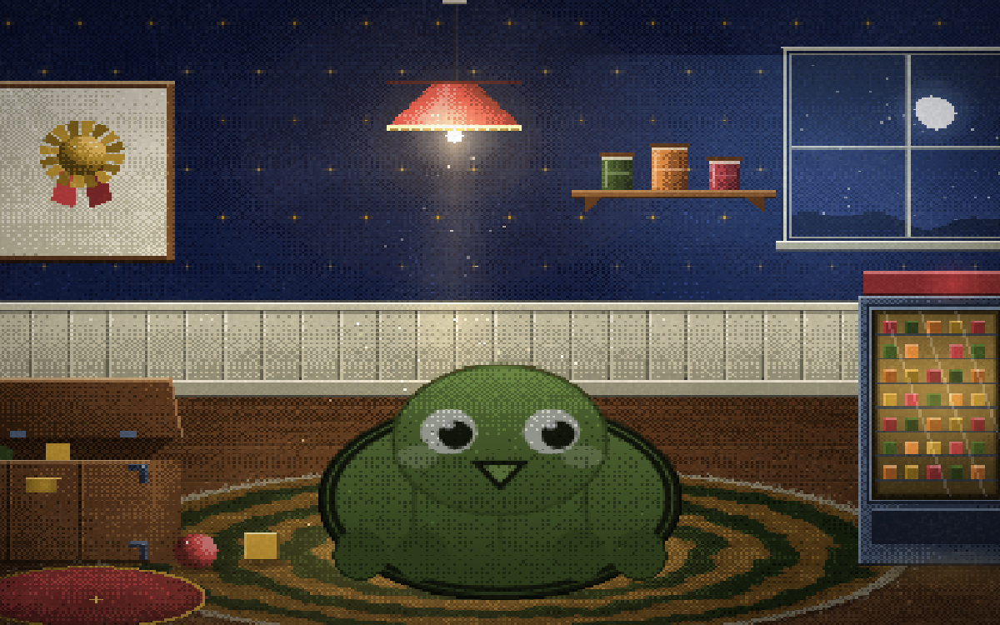

# ODDSEEDZ

A cozy, fully code-generated monster-ranching browser toy: summon strange creatures from
phrases, raise them on a schedule, bond with them in a toy room, coach them through ranked
tournaments, and retire them — alive — to a visible Memory Meadow whose records seed the
next generation. Seventy species. No death anywhere in it.

**Play it:** https://lerugray.github.io/field-trials/oddseedz/



## Run it

Open `index.html` for the source build, or build the single self-contained artifact:

```bash
npm run build          # writes dist/game/index.html plus a Pages wrapper at dist/index.html
open dist/game/index.html
```

Zero runtime dependencies — the built game is one file that boots from a double-click.

## Test it

```bash
npm test               # node --test — 305 tests (304 pass, 1 Playwright-gated skip)
npm run smoke          # parses the built artifact and asserts it is self-contained and bootable
```

The suite includes bot-simmed balance and pacing tests: the balance verdicts come from
simulation, never from hand-feel.

Browser probes (require Playwright — it is a devDependency here):

```bash
npm ci && npx playwright install chromium
node scripts/verify-audit-fixes.mjs 20260808   # re-runs the audit repros against current HEAD
```

## What's in here

- `src/` — engine, data (the species cast), renderer, UI.
- `test/` — the suite, including the balance and pacing sims.
- `scripts/` — the single-file build, the smoke gate, the soak, the audit re-verifier, and
  the dated capture scripts each art round shipped its proof frames from.
- `DESIGN-SEED.md` — the founding contract and the three named references it transposes.
- `docs/M8-audit.md` — genre-completeness audit: every table stake of the three references
  marked landed or deferred *with a named reason*.
- `docs/audits/AUDIT-20260808-kimi.md` — an independent adversarial audit by a different
  model, booting the built artifact in headless Chromium and probing the 16 claimed
  certification items against on-screen behaviour. Verdict: **NEEDS-A-ROUND**. It states
  its own standard plainly: green suites are necessary, not sufficient.
- `docs/audits/FIX-ROUND-20260808-report.md` — the fix round that answered it, finding by
  finding, including the findings that did **not** reproduce.

## Credits and asset licensing

Everything visual is procedural canvas — a hard rule of the project. The one exemption is
the music in `assets/music/`, supplied by the operator and credited to the pseudonym
**Abel Aeolian**; see `assets/music/README.md` for per-track notes and terms.

## A note on references to files that are not here

The design and audit documents in this directory sometimes cite the build-session harness
— the builder's hard-rules file, the running progress log, the dated operator direction
documents, the per-lane reports. Those are working documents of the build method and are
not published in this portfolio repository, so those citations point outside it. The
documents are otherwise verbatim: they are evidence, and editing them to tidy up the
references would make them worth less.
