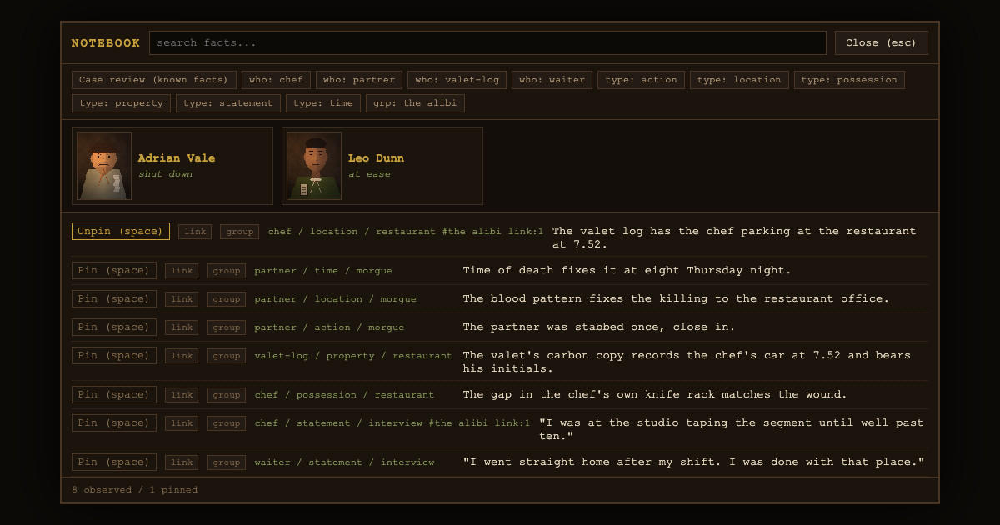

# SHOELEATHER

You watch the murder. Then you prove it. A point-and-click detective game in the register
of the 1970s American inverted TV mystery — you already know who did it, and the game is
assembling the one exact accusation chain that closes the case.

**Play it:** https://lerugray.github.io/field-trials/shoeleather/



## Run it

Open `index.html` in a browser for the source build, or build the single self-contained
artifact:

```bash
npm run build          # writes dist/shoeleather.html
open dist/shoeleather.html
```

Zero runtime dependencies; the built file boots from `file://`.

## Test it

```bash
npm test               # builds first, then node --test — 373 tests
```

The build runs as a pretest step because part of the suite inspects the built single file
for the access points and for residual external references.

Real-browser soak (requires a Chromium from the Playwright cache):

```bash
node scripts/soak.mjs  # drives a win path and a loss path with real DOM events; exits non-zero on failure
```

## What's in here

- `src/` — engine, world, evidence and case model, interrogation, rendering, audio.
  The unit tests are co-located with the modules they cover.
- `scripts/` — the zero-dependency build, the soak gate, and headless capture probes.
- `DESIGN-SEED.md` — the founding contract: the reference, the clean-room law (no real
  names, likenesses, episode titles, or plot copies), and the difficulty bar.
- `AUDIT-SKEPTICAL-2026-08-11.md` — the adversarial pre-release audit. Verdict:
  **FIX-FIRST**, 18 findings including one ship-blocker: an exhaustive sweep of the
  accusation board's 3,750-state space reached CASE CLOSED by brute force in both cases,
  which falsified the seed's own claim about the combinatorial defence. That finding, and
  the design-axis calls it forces, are written up in full rather than quietly patched.

## Controls

- Mouse over and click hotspots to move the investigation forward.
- Arrows/Tab cycle, Enter/Space select, `n` notebook, `?` help. Interrogation and the
  notebook are fully keyboard-capable.

## Credits and asset licensing

All art and music is generated by the game's own code — the score is composed in code and
synthesised at runtime. No third-party assets.

## A note on references to files that are not here

The design and audit documents in this directory sometimes cite the build-session harness
— the builder's hard-rules file, the running progress log, the dated operator direction
documents, the per-lane reports. Those are working documents of the build method and are
not published in this portfolio repository, so those citations point outside it. The
documents are otherwise verbatim: they are evidence, and editing them to tidy up the
references would make them worth less.
