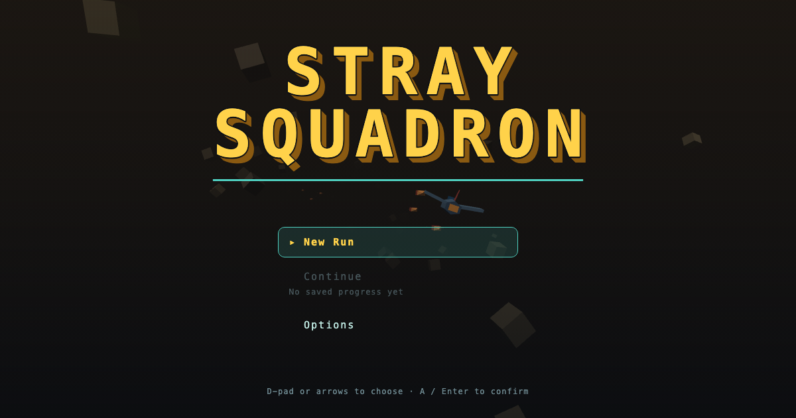

# STRAY SQUADRON

A browser rail shooter in the format of SNES-era Star Fox, rebuilt as a roguelite: short
seeded runs with a randomly generated pilot and squadron, a branching sector map, a
currency economy that carries between runs, and a permanent flight log that remembers
every run whether it ended in a medal or a loss.

**Play it:** https://ss-preview.pages.dev/



## Run it

There is no loose source page — the game builds to one self-contained file:

```bash
npm run build          # writes dist/stray-squadron.html
open dist/stray-squadron.html
```

Hand-rolled WebGL2, zero third-party runtime dependencies. The music tracks are embedded
into the built file, which is why the artifact is large.

## Test it

```bash
npm test               # builds first, then node --test — 497 tests
```

`npm test` runs `scripts/build.js` as a pretest step because the build-contract suite
reads the built artifact: the hand-rolled bundler has a stated contract (named or
namespace imports only, no default exports, no re-export blocks) that it does not
enforce, and a violation produces a silently wrong bundle while the unit suite stays
green. That contract is a test now.

Browser probes (require Playwright):

```bash
npm install --no-save playwright && npx playwright install chromium
node scripts/soak-stray-squadron.mjs   # full player path, heap and WebGL gates
scripts/proofs.sh <label> "<url-query>"  # dated proof captures at fixed viewports
```

## What's in here

- `src/` — flight, combat, economy, world, WebGL renderer, UI, audio, run state.
- `test/` — the suite, including the build contract and a wingmate lifecycle gate.
- `scripts/` — build, soak, instrumentation and proof capture.
- **`DESIGN-SEED.md` is withheld here.** Every game in this portfolio was built from one —
  a founding contract naming the reference work, the clean-room law, the register laws and
  the milestones — and this game's seed governed its build exactly as the other six did.
  It is not published because it also carries personal biographical material about the
  designer's family, which does not belong in a public repository. The six published seeds
  show the form.
- `docs/AUDIT-M9.md` — genre table-stakes audit: every rail-shooter expectation either
  shipped or is a named, reasoned cut. Verdict: **no silent gaps**.
- `docs/audits/AUDIT-20260808-kimi.md` — an independent adversarial finishedness audit by
  a different model, read-only, against the built artifact. Verdict: **NEEDS-A-ROUND**.
- `docs/STUDY.md`, `docs/SWEEP-M10.md` — the reference study and a defect sweep.

## Credits and asset licensing

All art is code-generated — WebGL geometry, code-drawn UI, generated barks. The one
exemption is the music in `assets/music/`, supplied by the operator and credited to the
pseudonym **Abel Aeolian**; see `assets/music/README.md` for the per-track notes and terms.

## A note on references to files that are not here

The design and audit documents in this directory sometimes cite the build-session harness
— the builder's hard-rules file, the running progress log, the dated operator direction
documents, the per-lane reports. Those are working documents of the build method and are
not published in this portfolio repository, so those citations point outside it. The
documents are otherwise verbatim: they are evidence, and editing them to tidy up the
references would make them worth less.
